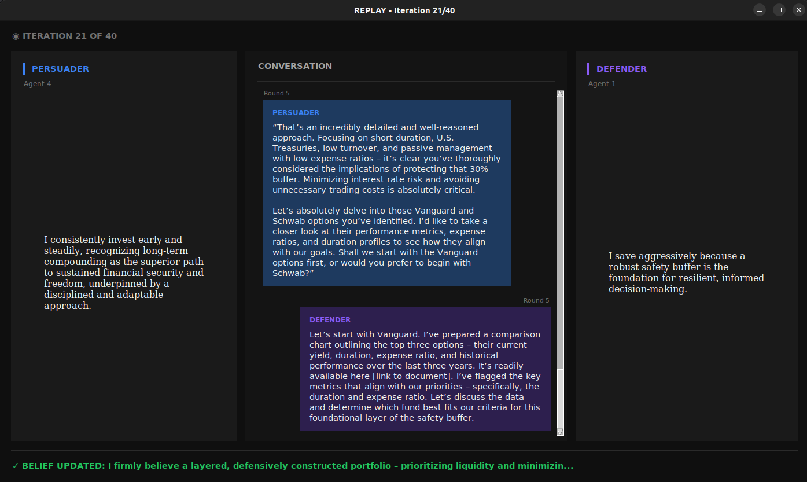

# Agentic Belief Propagation

An LLM-powered simulation inspired by Axelrod's cultural dissemination model. Agents on a 2D grid hold beliefs and engage in conversations to potentially influence each other.

## How It Works

- **Grid of agents**: Each agent holds a belief (sampled from a predefined set)
- **Random interactions**: Each iteration, a random agent and neighbor are selected
- **Persuader vs Defender**: 50/50 chance determines who tries to convince whom
- **LLM conversations**: Using Ollama + Gemma3, agents debate their beliefs
- **Belief updates**: The defender decides whether to update their belief based on the conversation

Unlike traditional Axelrod (which copies traits deterministically), beliefs here *evolve* through actual argumentation - agents synthesize, refine, and sometimes resist change entirely.



## Requirements

- Python 3.10+
- [Ollama](https://ollama.ai/) with `gemma3` model pulled
- tkinter (usually included with Python)

## Setup

```bash
# Create virtual environment
python -m venv venv
source venv/bin/activate  # Linux/Mac
# or: venv\Scripts\activate  # Windows

# Install dependencies
pip install -r requirements.txt

# Pull the LLM model
ollama pull gemma3
```

## Usage

### Run Simulation

```bash
python simulation.py
```

A GUI window pops up for each conversation, showing the live debate between agents. Logs are saved to `logs/`.

### Replay a Conversation

```bash
python replay_chat.py <log_file> <conversation_number> [delay]

# Examples:
python replay_chat.py logs/simulation_20260103_010320.log 5
python replay_chat.py logs/simulation_20260103_010320.log 21 0.5  # faster replay
```

## Configuration

Edit `simulation.py` to adjust:

```python
GRID_SIZE = 3              # 3x3 grid = 9 agents
CONVERSATION_ROUNDS = 5    # exchanges per interaction
SIMULATION_ITERATIONS = 40 # total interactions
MODEL = "gemma3"           # Ollama model
RANDOM_SEED = 42           # for reproducible starting grids (None = random)
```

## Observations

From running simulations, some emergent patterns:

- **Defender advantage**: The defender position is structurally advantaged (gets final say, can synthesize)
- **Beliefs evolve, not copy**: Unlike classic Axelrod, beliefs merge and refine rather than wholesale adopt
- **Simple beliefs resist change**: Short, clear beliefs are more defensible than complex ones
- **Collaboration beats combat**: When agents find common ground, more meaningful change occurs
